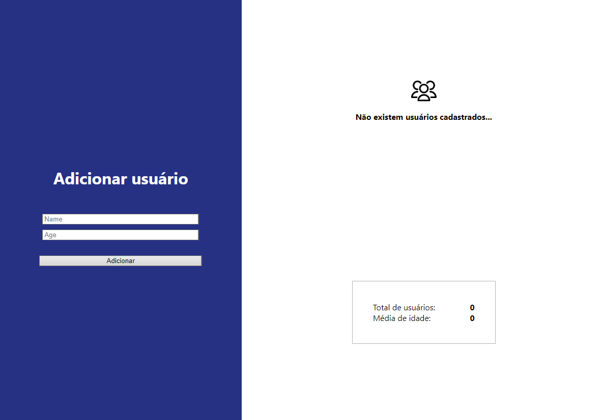

<h1 align="center"> Cadastro de pessoas com API de contexto </h1>

Página web de cadastro de pessoas e calcula a média das idades.

  <a href="#-tecnologias">Tecnologias</a>&nbsp;&nbsp;&nbsp;|&nbsp;&nbsp;&nbsp;
  <a href="#-projeto">Projeto</a>&nbsp;&nbsp;&nbsp;|&nbsp;&nbsp;&nbsp;
  <a href="#-layout">Layout</a>&nbsp;&nbsp;&nbsp;

 

  

## 🚀 Tecnologias

Esse projeto foi desenvolvido com as seguintes tecnologias:

- ReactJS
- HTML e CSS
- JavaScript
- Git e Github

## 💻 Projeto

Esse é um projeto simples que visa o estudo da criação de uma API de contexto para transição de informações entre os componentes da página.

## 🔖 Layout

Esse é um layout simples e não foi criado no Figma.
